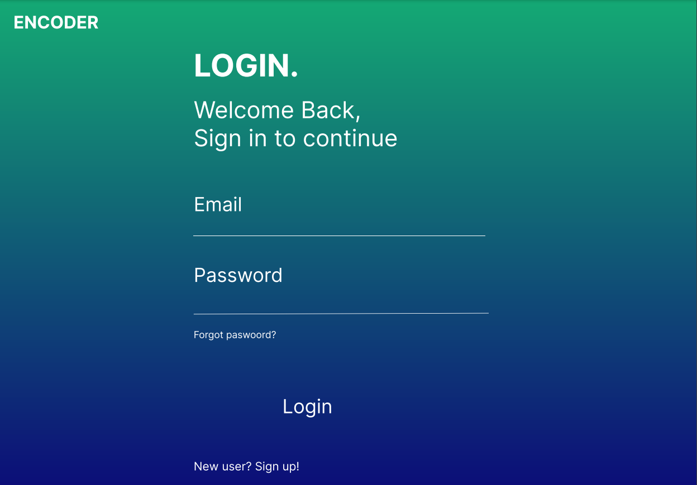
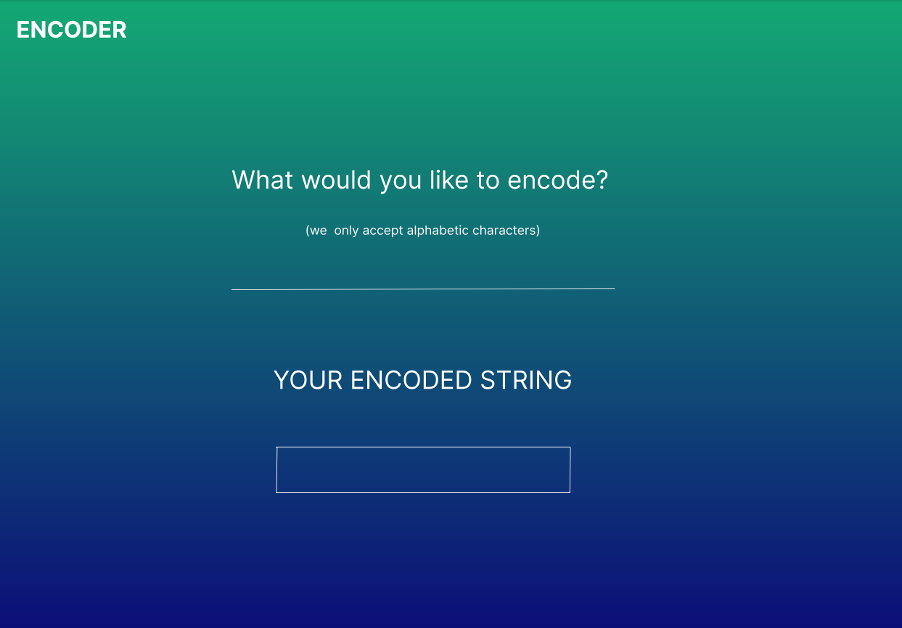

# Project Name
> Encoder application that allows user to encode a desired string after logging in
> Live demo [_here_](https://lovely-daifuku-962620.netlify.app/). 

## Table of Contents
* [General Info](#general-information)
* [Technologies Used](#technologies-used)
* [Features](#features)
* [Screenshots](#screenshots)
* [Setup](#setup)
* [Usage](#usage)
* [Project Status](#project-status)
* [Room for Improvement](#room-for-improvement)
* [Acknowledgements](#acknowledgements)
* [Contact](#contact)

## General Information
- Encoder application that allows user to encode a desired string
- User first must login in order to encode a string
- The inputed string must only contain alphabetic characters

## Technologies Used
- Node - version 16.17.0
- React - version 18.2.0
- Express - version 4.17.1

## Features
- User can login by providing a valid email address and password
- Password has to have at least 6 characters and 1 number
- Encoder function returns an encoded string based on the input

## Screenshots

**Login page**

**Encoder page**

Original design was made with Figma and can be found [here](https://www.figma.com/file/wkeTz06oUCZd2czqPQRAAY/Encoder?node-id=0%3A1&t=5RkEwdcaw7W7bpoL-1).

## Setup

In orded to run this project first clone this repository with following command:

`git clone https://github.com/veronika-simic/login.git`

Install the dependencies with the following command

`npm install`

After that run the project from the root with 

`npm start`

To see the project in browser visit: 

> http://127.0.0.1:5173/

Documentation is available at: 

> http://localhost:4000/api-docs
## Usage
Login with authorized credentials provided in the servers login.js
Input a string you would like to encode

## Project Status
Project is: _in progress_

## Room for Improvement

Room for improvement:
- Allow first time users to sign up
- Deliver the encoded string to the email address provided by the user

## Acknowledgements
- Many thanks to [@damirsehic](https://github.com/damirsehic/code-challenge) for providing base for server

## Contact
Created by [@vera](https://github.com/veronika-simic) - feel free to contact me!
